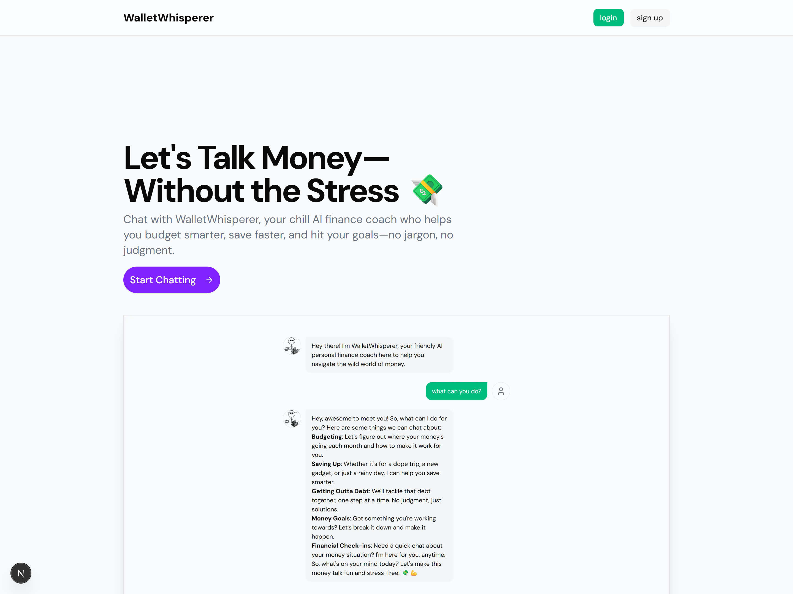

# 🧠 WalletWhisperer

**WalletWhisperer** is an AI-powered personal finance coach that chats like a friend and delivers structured financial reports — no spreadsheets, no shame, just smarter money moves.

Built with Gen Z users in mind, the chatbot provides conversational financial coaching and generates a structured JSON report summarizing key insights, forecasts, debt plans, and more.



## 🚀 Features

- 💬 Chat-based financial guidance using LLMs
- 📊 Auto-generated, structured financial reports via Zod schema
- 📈 Forecasts for savings goals and debt payoff plans
- 💡 Smart suggestions + a financial health score + personalized summary
- 🧾 Supabase integration
- 🛠️ Built with Next.js 15 + App Router

---

## 🛠️ Stack

- **Full-stack**: Next.js 15 (App Router), Tailwind CSS
- **LLM**: Mistral AI
- **Schema Validation**: Zod
- **Database**: Supabase (PostgreSQL)

---

## 📄 Zod Schema

All reports returned from the LLM follow a strict [`WalletWhispererReportSchema`](./app/actions/reports/schema.ts). This ensures data consistency for:

- Session summaries
- Financial snapshots
- Savings forecasts
- Debt repayment projections
- Financial health scores

---

## 🧠 Prompt Design

The chatbot operates using a system prompt optimized for financial coaching, empathy, and clarity. It guides users toward revealing structured data points conversationally (goals, income, debt, etc.).

---

## ✨ Upcoming Features

- User accounts with report history
- PDF export of financial reports
- Goal reminders via email/SMS
- More AI insight types (investments, retirement, etc.)

---

## 🤝 Contributing

Pull requests are welcome! If you’ve got ideas for prompts, financial insight modules, or improvements to the UX, feel free to open an issue or PR.

---

## 🔗 Links

- 🌐 Live App: [walletwhisperer.com](https://walletwhisperer.com)
- 🧠 Schema: [`WalletWhispererReportSchema`](./lib/schemas/report.ts)
- 🐦 Follow: [@yourhandle](https://twitter.com/yourhandle)

```

```
