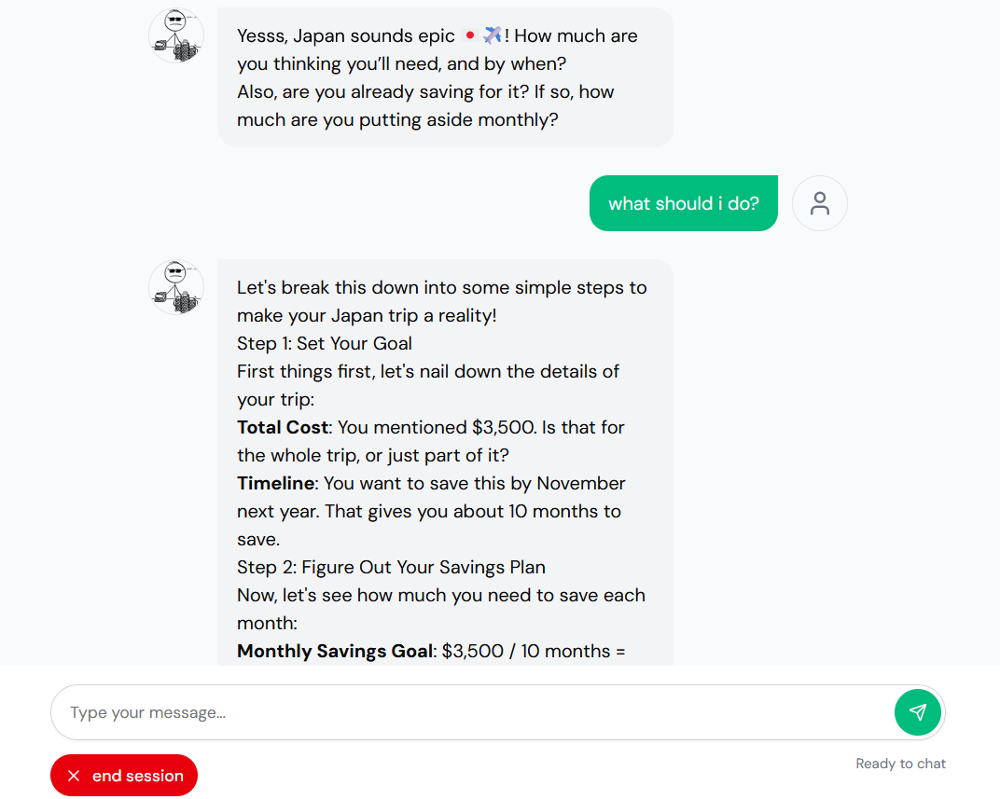

# 🧠 WalletWhisperer

**WalletWhisperer** is an AI-powered personal finance coach that chats like a friend and delivers structured financial reports — no spreadsheets, no shame, just smarter money moves.

Built with Gen Z users in mind, the chatbot provides conversational financial coaching and generates a structured JSON report summarizing key insights, forecasts, debt plans, and more.

## 🚀 Features

- 💬 **Smart Chat Interface**: Engage in natural conversations about your finances
  

- 📊 **Structured Reports**: Get clear, organized financial insights
  

- 📈 **Financial Forecasting**: Plan your savings and debt payoff with AI-powered projections
  

- 💡 **Personalized Insights**: Receive tailored suggestions and a comprehensive financial health score
  

- 🧾 **Secure Data Storage**: All your financial data is safely stored in Supabase
- 🛠️ **Modern Tech Stack**: Built with Next.js 15 + App Router for optimal performance

## 🛠️ Tech Stack

- **Frontend**: Next.js 15 (App Router), Tailwind CSS
- **AI Engine**: Mistral AI
- **Data Validation**: Zod
- **Database**: Supabase (PostgreSQL)
- **Deployment**: Vercel

## 📊 Data Structure

All reports follow a strict [`WalletWhispererReportSchema`](./app/actions/reports/schema.ts) that ensures consistent, reliable data for:

- Session summaries and user intent
- Financial snapshots (income, expenses, debt)
- Savings forecasts and projections
- Debt repayment plans
- Financial health scores
- Asset and liability breakdowns

## 🧠 AI Features

The chatbot uses a carefully crafted system prompt optimized for:

- Empathetic financial coaching
- Clear, jargon-free communication
- Structured data collection
- Personalized insights and recommendations

## ✨ Roadmap

- [ ] User authentication and report history
- [ ] PDF export functionality
- [ ] Email/SMS goal reminders
- [ ] Investment and retirement planning
- [ ] Mobile app development
- [ ] Integration with financial institutions

## 🤝 Contributing

We welcome contributions! Whether you're interested in:

- Improving the AI prompts
- Adding new financial insight modules
- Enhancing the user experience
- Fixing bugs or adding features

Feel free to:

1. Fork the repository
2. Create a feature branch
3. Submit a pull request

## 🔗 Links

- 🌐 [Live App](https://walletwhisperer.vercel.app/)
- 🧠 [Schema Definition](./app/actions/reports/schema.ts)
- 👾 [Developer Website](https://brianmillonte.vercel.app/)

## 📱 Screenshots

